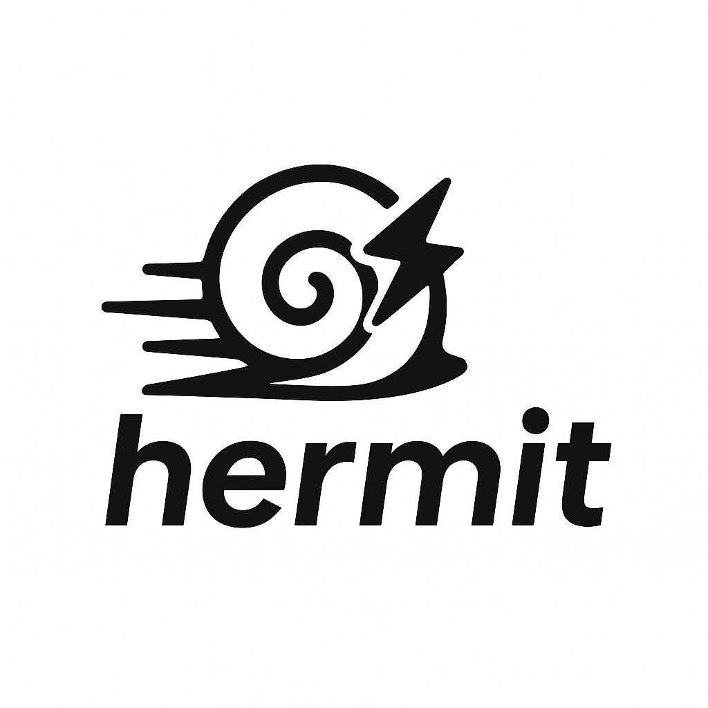

# 🐚 Hermit — Lightweight Virtual Machine Environments for Developers

<p align="center">
  
</p>

[](LICENSE)
[]()
[](https://golang.org/dl/)
[]()

---

## 🧠 What is Hermit?

**Hermit** is a fast, developer-friendly CLI for creating and managing Linux-based development environments using Virtual Machines — without plugins, heavy runtimes, or complex provisioning tools.

Hermit focuses on:

- Simplicity over extensibility
- Speed over generality
- Clean developer experience over full-stack abstraction

If you have ever found Vagrant too slow, Docker too containerized, and setting up dev VMs too painful — Hermit is for you.

---

## ⚙️ System Requirements

| Requirement      | Version                     |
|------------------|------------------------------|
| OS               | Windows, macOS, or Linux     |
| VirtualBox       | 7.1.4 (required)             |
| Go (for development)   | 1.21+                        |


> ➡️ Download [VirtualBox 7.1.4](https://download.virtualbox.org/virtualbox/7.1.4/)

## 📥 Installation

Visit the [GitHub Releases page](https://github.com/Kodo-Robotics/hermit/releases) and download the binary for your OS:

### 🔧 macOS / Linux

```bash
# Download the latest binary (Select from releases page depending on your system)
curl -Lo hermit https://github.com/Kodo-Robotics/hermit/releases/latest/download/hermit-linux-amd64

# Make it executable
chmod +x hermit

# Move to a directory in your PATH
sudo mv hermit /usr/local/bin/
```

### 🪟 Windows

1. Download hermit-windows-amd64.exe from the Releases page
2. Rename to hermit.exe (optional)
3. Add the directory to your PATH
4. Run Hermit via terminal: `hermit`


## ✨ Features

- 🧰 Full VM lifecycle: `init`, `up`, `halt`, `destroy`, `status`
- 🔐 SSH with NAT-based port forwarding
- 🌐 Dual-NIC support: always NAT + bridged/host-only
- 🧠 Human-friendly config via hermit.json
- 📦 Package and share VMs as .box files
- ⚡ Blazing fast CLI (built in Go)

## 📦 Try the Dev Box (Prebuilt)

Spin up a complete Ubuntu-based dev environment with:

✅ VS Code Server (browser on :8080)
✅ Python 3, Git, Node.js, Docker
✅ SSH (vagrant@localhost:2222)

### 📥 Download:
👉 [dev-box-amd64.box (Google Drive)](https://drive.google.com/file/d/1Vd5e3S0KVM4FsozeRlHT2T7krWCM0lXW/view?usp=share_link)
👉 [dev-box-arm64.box (Google Drive)](https://drive.google.com/file/d/1bQJrzbXTuGISAtVtvtr58o-bASbXsyG4/view?usp=share_link)

### 🔧 Usage:

```bash
hermit init dev-box
hermit box add dev-box.box
hermit up
hermit ssh               # SSH access
# open http://localhost:8080 for VS Code in browser
```

## 🧙 Sample hermit.json

```json
{
  "vm_name": "dev-box",
  "box": "dev-box",
  "memory": 2048,
  "cpus": 2,
  "network": {
    "mode": "nat",
    "forwarded_ports": [
      { "guest": 22, "host": 2222 },
      { "guest": 8080, "host": 8080 }
    ]
  }
}
```

## ❓ Why Hermit vs. Vagrant?

| Metric / Feature         | Hermit (Go)                 | Vagrant (Ruby)             | Improvement with Hermit      |
|--------------------------|-----------------------------|-----------------------------|-------------------------------|
| **CLI Language**         | Go (native binary)          | Ruby                        | ✅ No runtime required         |
| **Install Size**         | ~15 MB                      | ~350 MB+                    | ✅ ~20× smaller                |
| **CLI Startup Time**     | ~0.05s                      | ~2.3s                       | ✅ ~45× faster                 |
| **VM Boot Time**         | ~30–45s                     | ~2–5 minutes                | ✅ 2–4× faster                 |
| **Memory Usage**         | ~500 MB (minimal)           | ~800 MB+                    | ✅ Lower runtime overhead      |
| **Config Format**        | JSON (`hermit.json`)        | Ruby DSL (`Vagrantfile`)    | ✅ Cleaner, language-agnostic  |
| **Networking (NAT + Bridged)** | Built-in & simple       | Verbose & plugin-sensitive  | ✅ Easier dual-NIC config      |
| **Box Packaging**        | `hermit package`            | `vagrant package`           | ✅ Smaller, faster             |
| **Port Forwarding**      | JSON-based, automatic       | Requires manual config      | ✅ Works out of the box        |
| **Provisioning**         | Planned                     | Supported                   | ➖ Coming soon                 |
| **Target Users**         | Developers & local use cases| DevOps/general provisioning | 🎯 Focused & developer-friendly |


## 🛠 Core Commands

| Command           | Description                          |
|-------------------|--------------------------------------|
| `hermit init`     | Create a new `hermit.json`           |
| `hermit up`       | Start the VM                         |
| `hermit halt`     | Shut down the VM                     |
| `hermit destroy`  | Unregister and optionally delete     |
| `hermit ssh`      | SSH into the guest                   |
| `hermit status`   | Show VM state                        |
| `hermit package`  | Export the current VM to `.box`      |
| `hermit box add`  | Register a downloaded `.box`         |

## 📦 Build Your Own .box

```bash
hermit up
hermit ssh       # install tools, setup env
hermit halt
hermit package --output my-env.box
```

## 👥 Community

We welcome ideas, feedback, and contributions:

🐛 [GitHub Issues](https://github.com/Kodo-Robotics/hermit/issues)

## 📄 License

Apache 2.0 © 2025 Kodo-Robotics